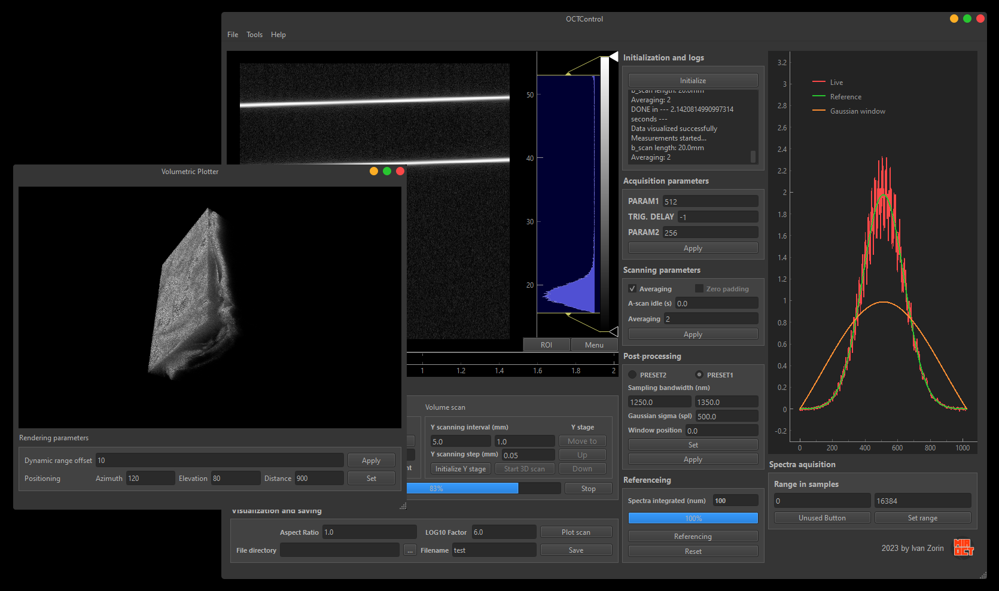

# OCT python GUI for b- and volumetric scanning

GUI for controlling the OCT system in the frequency domain

The GUI software is versatile for rapid prototyping - one need to change the signal source (change the GetBufferThread buffer flow) and sample scanning parameters; for demonstration purposes [now] a chirped OCT signal is generated in a loop.
The GUI is set up for a stepped approach; but can be modified to continous scan (e.g. with galvo) if the measurement speed is fast enough. In this case, modify the user interface ('./uis/design_gui.ui') using QT designer. Python acquisition speed, when looped, is pretty slow; if a faster performance is needed implement read-out of the whole B-scan data at once from the signal-source buffer (not in a line to line manner). This increases the speed drastically. 

# Installation

To install all the dependencies, run `pip install -r requirements.txt`

Run `main.py`

## Calibration vector (amplitude-based correction)
Calibration allows to linearize wavelength-domain signals and eliminate nonlinearities of spectral interferograms in k-space. The calibration vector is determined using an amplitude approach: after interferogram processing, peak positions are determined, and evaluated to be linearized (in the ideal k-space the distanes are constant). An example of the generation of the vector is given in './generate_calibration_vector'. Certain parameters, such as gaussian filter width, peak height etc should be adjusted manually.

## Limitations
The speed of the step-scan approach seems limited due to (1) the loop rate in Python and (2) If on Windows, the minimum timer time resolution in Windows is 1 ms; therefore 1 kHz seems to be a limit.

# Struture of components

## "modules" folder 
1. `get_buffer_thread.py` is the separated thread that gets a signal from any type of source of spectral interferograms (e.g. a detector in SSOCT, a camera in FDOCT)
    - load the necessary imports in here and integrate your device: `self.shared_vars.buffer_signal` get the signal
2. `octlib.py` is a library for OCT post-processing, an instance is created with `with` in the corresponding measurement thread; it contains two methods:
    - `remap_to_k` -- a method for remapping/linearization of spectral interferograms; if calibration vector and boundaries are not given, simply remaps wavelengths to wavenumbers
    - `scan_process` -- a method that performs a 1D FFT along an axis for the windowed linearized spectral interferograms
3. `oct_lib_func.py` -- the same as octlib.py but realized as functions [not used in the latest version]
4. `proc_ui.py` -- autogenerated GUI form from `./uis/design_gui.ui` use `pyside6-uic ./uis/design_gui.ui -o ./modules/proc_ui.py` to regenerate if the GUI form updated
5. `help_ui.py` -- autogenerated second help window form from `./uis/design_gui.ui` use `pyside6-uic ./uis/help_ui.ui -o ./modules/help_ui.py ` to regenerate if updated
6. `shared_vars.py` -- a class with the shared among the threads variables; contains methods to save (Ctrl+S) and load parameters (at initialization)

## "settings" folder 
1. `calibration_vector.npy` and `boundaries.npy` if exist should be placed here
2. `config.cfg` -- saved parameters 
3. `ref.npy` -- reference (i.e. background) spectrum

## "uis" folder 
the `uis` folder contains qtDesigner forms of the GUI to be modified

### Python version

The GUI was tested with Python 3.7, 3.8, 3.10, 3.11; the latest version demonstrated the best preformance